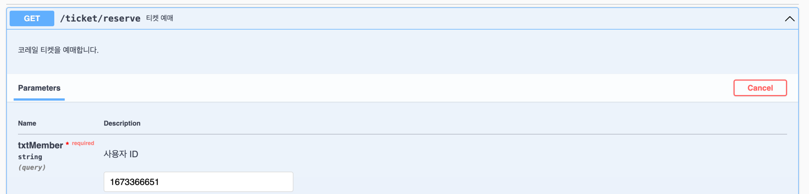
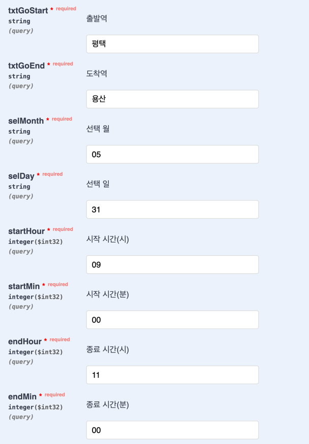

__⚠️  &nbsp;해당 프로젝트는 개인적인 용도로만 사용하여 주시고, 불법적인 거래나 행위는 엄격히 금지됩니다.__   
__&nbsp; &nbsp; &nbsp; &nbsp;&nbsp;본 프로젝트 사용 시 관련 법률, 규정 및 서비스 약관을 준수하는 것은 사용자의 책임입니다.__   
__&nbsp; &nbsp; &nbsp; &nbsp;&nbsp;본 프로젝트의 사용으로 인한 어떠한 문제에 대해서도 본 프로젝트 개발자는 책임을 지지 않습니다.__

---

__⚠️  &nbsp;Please use this project for personal use only, and illegal transactions or acts are strictly prohibited.__   
__&nbsp; &nbsp; &nbsp; &nbsp;&nbsp;It is your responsibility to comply with the relevant laws, regulations and terms of service__   


1. application.yaml 에 본인의 gmail 계정과 app password를 입력합니다. app password는 본인의 로그인 비밀번호가 아니라, 
   구글 계정에서 생성한 앱 비밀번호를 입력해야 합니다. recipient는 본인이 예약 완료 메일을 받을 이메일 주소를 입력합니다.

```
# https://blogan99.tistory.com/101 참고해서 생성하기.
# 1. 구글 Gmail SMTP 사용 위한 설정. 구글 사이트 > 프로필 클릭 > Google 계정 관리. 검색창에 > "앱 비밀번호" 검색 · 2. 코레일_예약후_메일보내기어플 같은 이름 설정 3. app password를 공백없이 이어붙인다 16자리.
```


2. 이 어플리케이션을 실행시킵니다 (jdk 21 이상 필요합니다).


3. http://localhost:8080/swagger-ui/index.html 페이지가 뜨면 잘 실행된것입니다.

4. 예약을 하고 싶으면, try it out 버튼을 눌러 실행합니다



사용자 ID는 코레일 회원 번호입니다


5. 선택 월, 일, 시, 분, 은 모두 숫자여야하고, 24시간 기준입니다. 0을 앞에 붙이지 않으면 실행되지 않습니다. 
   선택 월은 `01~12`, 선택 일은 `01~31`, 선택 시는 `0~23`, 선택 분은 `0~59` 사이의 숫자여야 합니다.



6. 예약을 성공하면, 예약번호와 함께 예약이 완료되었다는 메일이 옵니다. 


### 개발자 참고

WINDOW POWERSHELL에서 ./gradlew.bat clean bootJar 할때 아래처럼 JAVA_HOME 세팅해주기

```
$env:JAVA_HOME = "C:\Users\USER\Documents\works\KTX_auto_reserve\jdk"
$env:PATH = "$env:JAVA_HOME\bin;" + $env:PATH
```